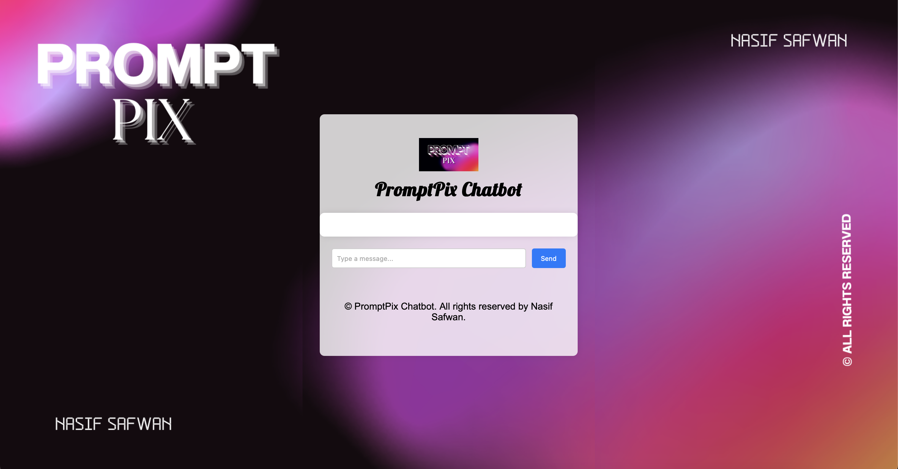
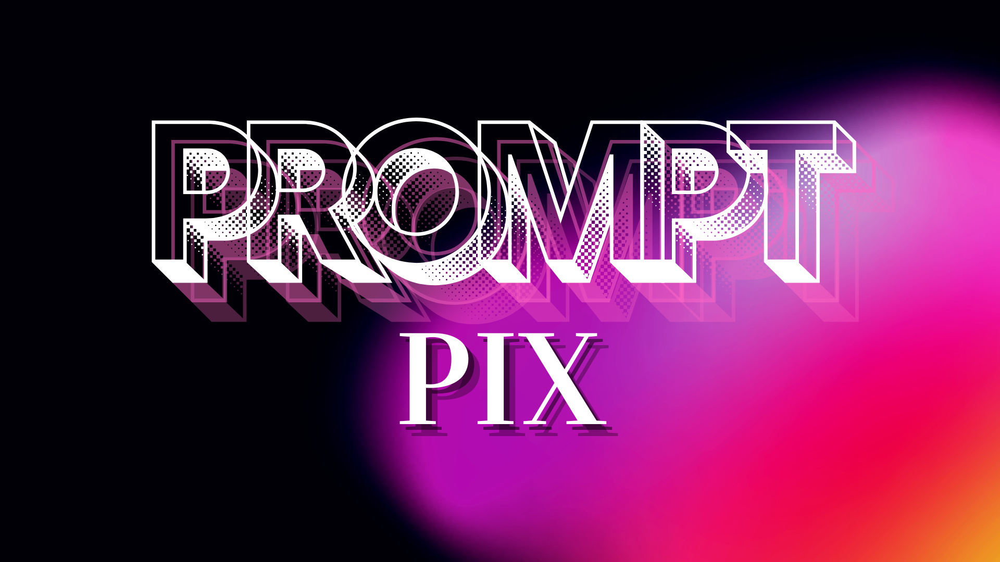

# 🌟 PromptPix - The AI Chatbot That Paints Your Imagination 🎨🤖



## 🚀 Introduction
**PromptPix** is an AI-powered chatbot that not only converses dynamically but also generates stunning images using **Stable Diffusion**! Whether you want to chat casually or bring your imagination to life through AI-generated visuals, **PromptPix** is here to amaze you.

## ✨ Features
✅ **Smart Conversation** – Greets and interacts dynamically based on your messages.  
✅ **AI-Powered Image Generation** – Uses **Stable Diffusion** to create breathtaking images from text prompts.  
✅ **Seamless User Experience** – Chat like a human and generate images effortlessly.  
✅ **Open-Source & Extensible** – Modify and improve the chatbot as you wish!

## 🔥 How It Works
1. **Start a conversation** – Say "Hi", "Hello", or "Good morning" to see dynamic responses.  
2. **Generate an image** – Type something like _"Generate a futuristic cityscape"_, and watch PromptPix create it for you.  
3. **Enjoy the magic!** ✨

## 🛠️ Installation & Setup
Follow these simple steps to run PromptPix on your local machine:

### 📥 Clone the Repository
```bash
git clone https://github.com/yourusername/promptpix.git
cd promptpix
```

### 📦 Install Dependencies
```bash
pip install -r requirements.txt
```

### 🔧 Run the Chatbot
```bash
python app.py
```

## 🖼️ Example Output
### 💬 Chat Example:
```
User: Hi!
PromptPix: Hello! How can I assist you today?
```

### 🎨 Image Generation Example:
```
User: Generate a sunset over the ocean
PromptPix: Generating your masterpiece... 🎨
```


## 🎯 Future Enhancements
- 🗣️ **Voice Input & Output** for a more interactive experience.  
- 🎭 **Style Customization** for images (e.g., anime, realism, sketch).  
- ☁️ **Cloud Deployment** for global access.  

## 👨‍💻 Contributing
Pull requests are welcome! Feel free to fork the repository and enhance PromptPix.

## 📜 License
This project is licensed under the **MIT License**.

## 🌐 Connect with Me
💼 [LinkedIn](https://www.linkedin.com/in/nasifsafwan)  
📧 [Email](mailto:nasifsafwan@gmail.com)  
🔗 [GitHub](https://github.com/nasifsafwan)

---
💡 _"Turning words into art, one prompt at a time."_ 🚀
